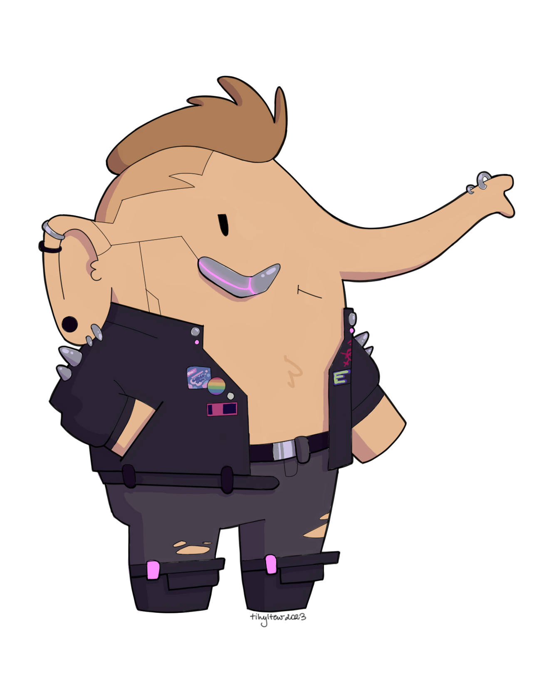
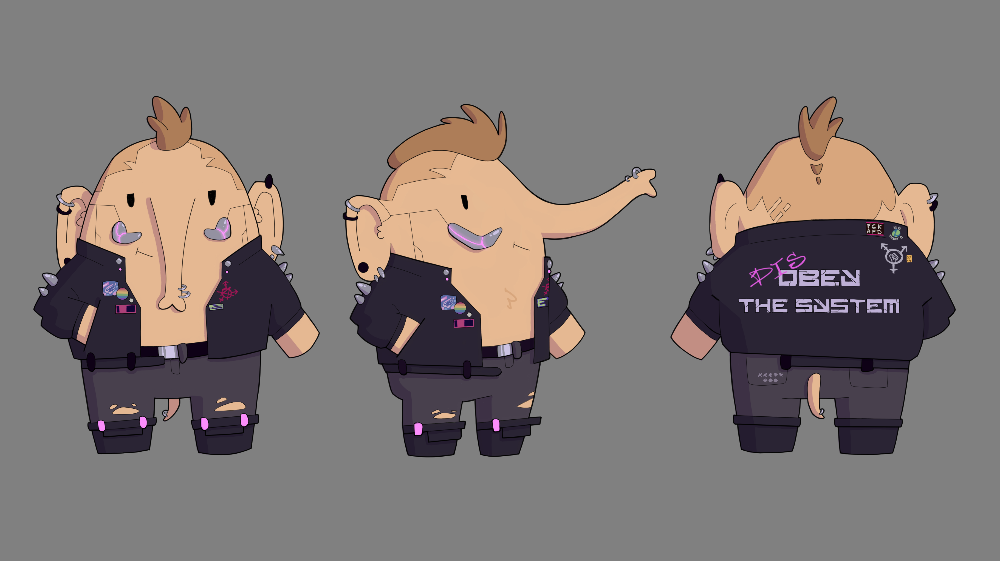
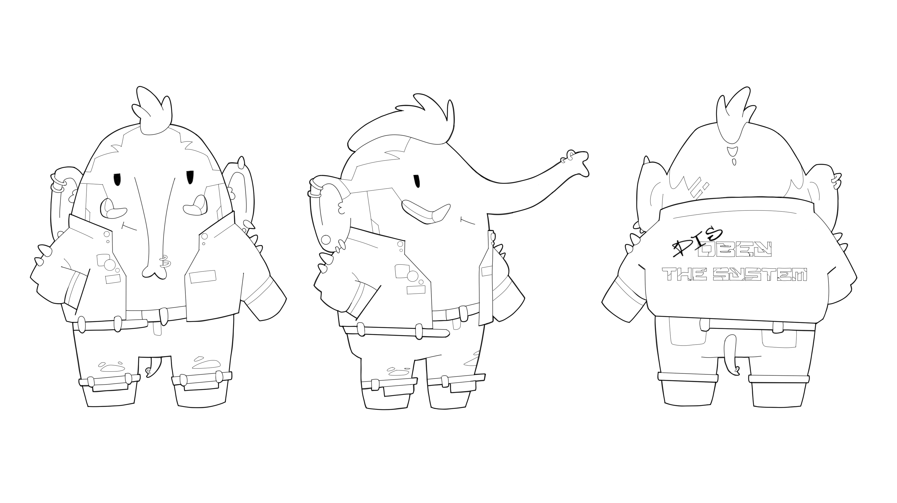

# Cyberdon
A mastodon mascot for CORTEX IMPLANT with a cyberpunk twist.

</img>

[Available without the signature](cyberdon_nosignature.png)

## Patches & pins

Click to expand
 

Front:
- Bubblegum Durstlöscher (corteximplant.com inside joke)
- LGBTQIA+ rainbow pin
- CYBERWARE Asset – [Redbubble](https://www.redbubble.com/shop/ap/147546809)
- Trans anarchy
- Netrun Until It Breaks – [Redbubble](https://www.redbubble.com/shop/ap/147608592)

Back:
- *DIS*[**OBEY THE SYSTEM**](https://obeythesystem.com)
- ***** *** – [Urban Dictionary](https://www.urbandictionary.com/define.php?term=*****%20***)
- FCK AFD
- No Planet B
- No TERFs on our turf
- Not my king

## Turnaround
Colour                                                     |  Black & White Ink
:---------------------------------------------------------:|:-------------------------------------------------------------:
       | 
[Available with no shadows](turnaround/cyberdon_colour_noshadows.png) | [Available as a traced vector](turnaround/cyberdon_ink_traced.svg)

## License
This artwork is made by [**tihyltew**](https://corteximplant.com/@tihyltew) and licensed under [CC BY-SA 4.0](LICENSE).

> You are allowed to share, adapt, and use the artwork privately or commercially under these conditions:
> - Attribution - you must credit the author appropriately
> - Share Alike - you must distribute any modifications of the work under the same license
> 
> This is just an overview of the license, for more details read the [license document](LICENSE).
